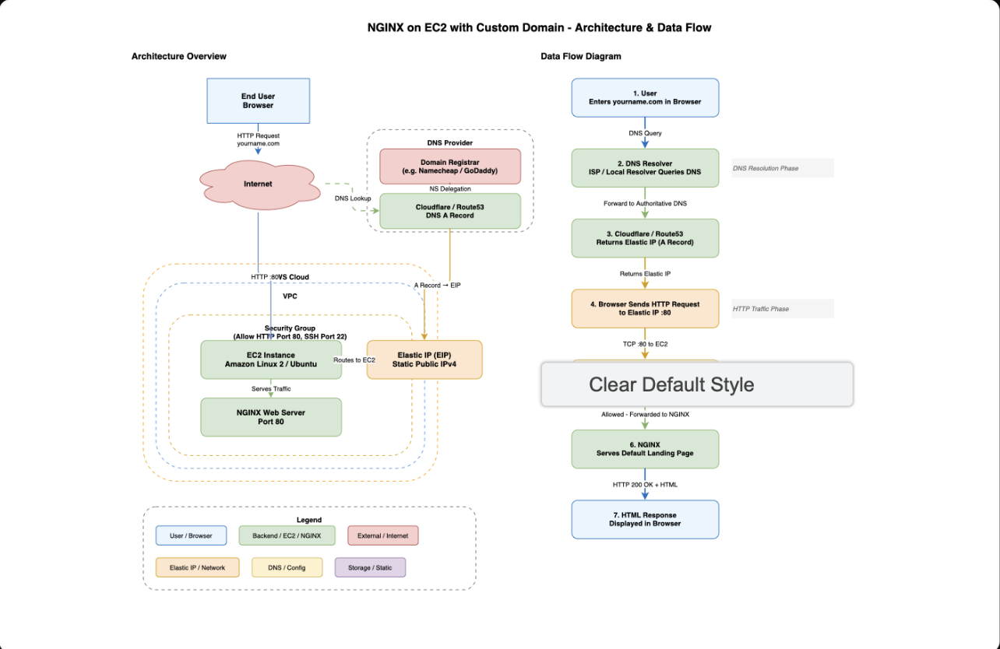
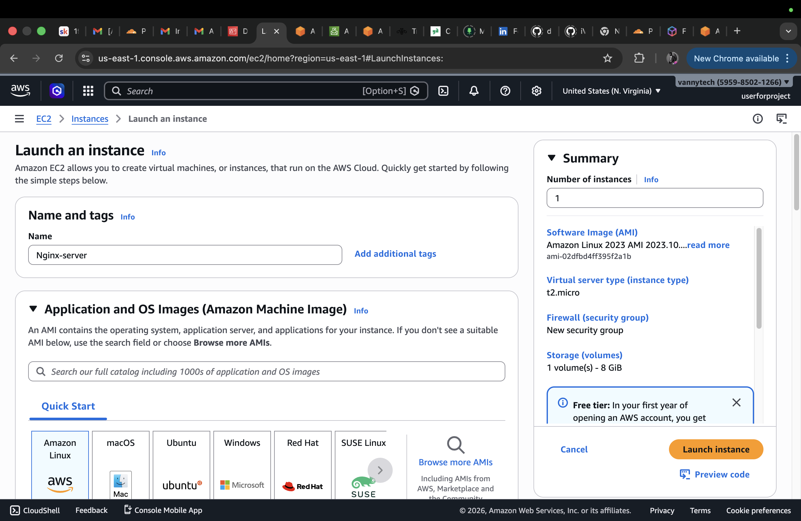
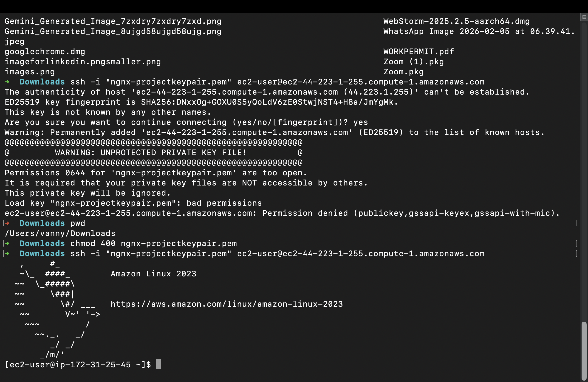
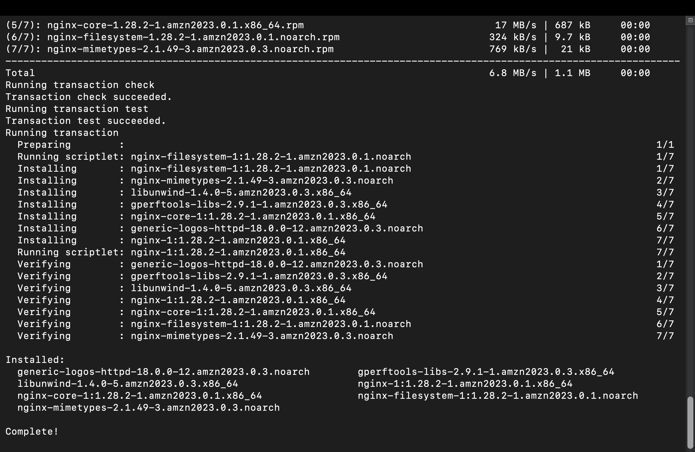
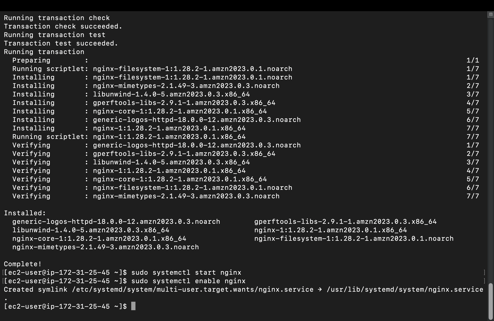
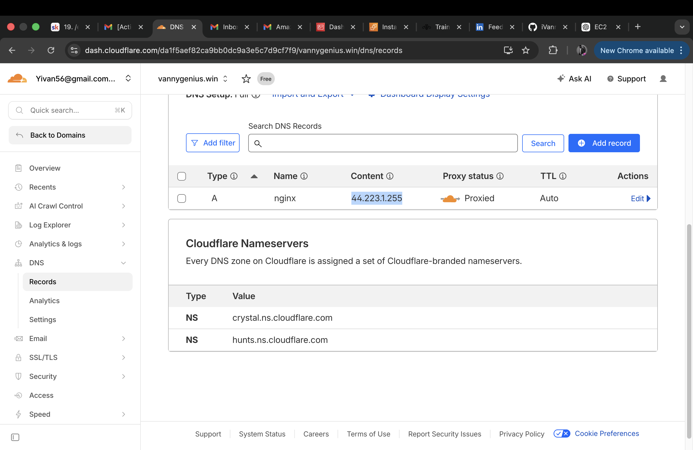
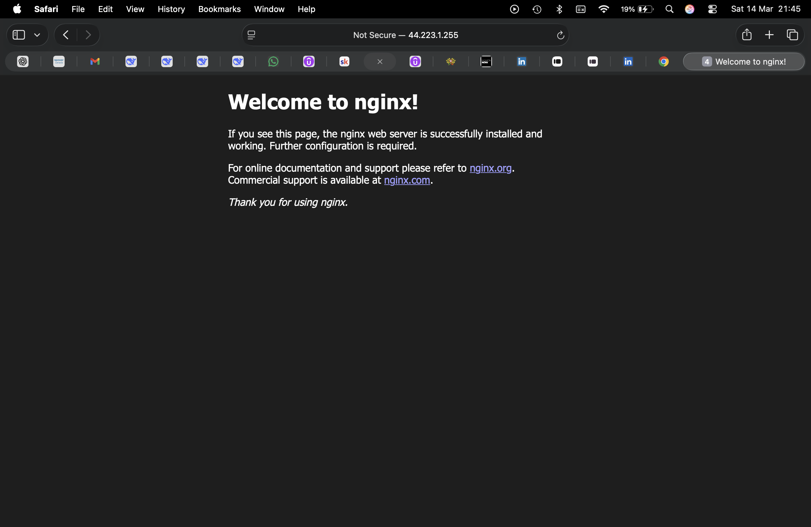

# AWS EC2 + NGINX + DNS Hosting Project

## Project Overview

This project demonstrates how to deploy a web server in the cloud and connect it to a custom domain using DNS.

The project covers core networking concepts such as:

- IP Addressing
- DNS Resolution
- HTTP Protocol
- Cloud Firewalls (Security Groups)
- Linux Web Server Configuration

Technologies Used

- AWS EC2
- NGINX
- Cloudflare / Route53
- Linux (Amazon Linux 2)
- GitHub

---

# Architecture

User Browser → Domain → DNS → EC2 Public IP → NGINX → Web Page

---

# Step 1: Launch EC2 Instance

An EC2 instance was launched using Amazon Linux 2.

Instance Type:
t2.micro (Free Tier)

Security Group Rules:

| Type | Port | Source |
|-----|-----|-----|
| SSH | 22 | My IP |
| HTTP | 80 | Anywhere |

Screenshot:



# Step 2: Connect to EC2

SSH was used to connect to the instance.

Example command:
```
ssh -i "my-key.pem" ec2-user@EC2-PUBLIC-IP
```

Screenshot:



---

# Step 3: Install NGINX

Commands used:

```
sudo yum update -y
sudo yum install nginx -y
sudo systemctl enable nginx
sudo systemctl start nginx
```

Screenshot:



---

# Step 4: Verify Web Server

The NGINX server was tested using the EC2 public IP.

Example:

```
http://EC2-PUBLIC-IP
```

Screenshot:



---

# Step 5: Configure DNS

An A record was created to point the domain to the EC2 instance.

Example DNS Record:

```
Type: A
Name: nginx
Value: EC2 Public IP
```

Screenshot:



---

# Step 6: Access Website via Domain

After DNS propagation, the domain successfully loaded the NGINX default page.

Example:

```
http://nginx.yourdomain.com
```

Screenshot:



---

# Outcome

Successfully deployed an NGINX web server on AWS EC2 and accessed it via a custom domain using DNS.

This project demonstrates practical understanding of:

- Cloud infrastructure
- Networking fundamentals
- Linux server administration
- DNS configuration
